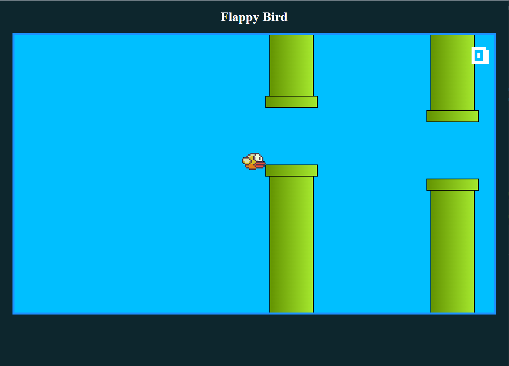

<h1 align="center">Flappy Bird 🐦 </h1>

Projeto exclusivo de minha autoria e Tipscode.

 

  

## 🚀 Tecnologias

Esse projeto foi desenvolvido com as seguintes tecnologias:

- HTML e CSS
- JavaScript
- Git e Github

## 💻 Projeto

O Projeto se trata de um jogo chamado Flappy Bird, no qual um passaro deve passar pelos obstaculos, sendo controlado pelo botão espaço do teclado, evitando que o mesmo esconte nos canos e zere sua pontuação.